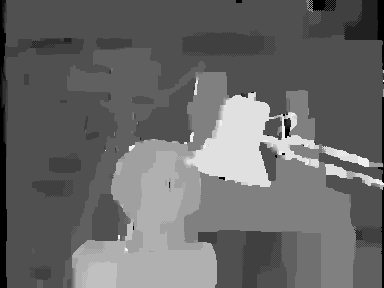

# Stereo Matching using Belief Propagation (Very Fast)
A Matlab implementation of Loopy Belief Propagation for stereo matching that **focuses on speed**. It uses matrix operations and other techniques to make the code even faster.

## Input Image
The Tsukuba stereo image that used as input.

   

## Output Image
The disparity map that created at the output.

   

