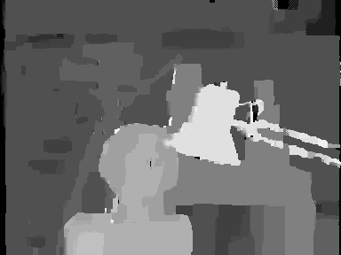

# Stereo Matching using Belief Propagation (Optimized)

> **Repository Moved**  
> This project has been merged into [Stereo Matching Algorithms in MATLAB and Python](https://github.com/aposb/stereo-matching-algorithms).  
> The new repository contains the latest code, documentation, and updates.

An optimized Matlab implementation of Loopy Belief Propagation for stereo matching that **focuses on speed**. It uses matrix operations and other techniques to make the program run even faster.

## Input Image
The Tsukuba stereo image that used as input.

   

## Output Image
The disparity map that created at the output.

   

